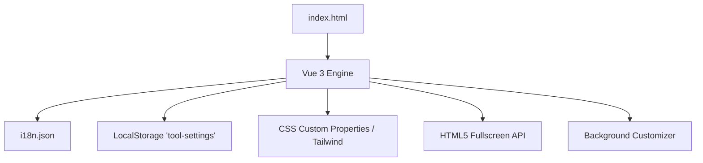

# Web Tool Scaffolding & Development Guide

このドキュメントは、`free-web-tools` プロジェクトに新しく便利ツールを追加する際、ユーザー体験（UX）と品質を共通化するための**開発ガイドライン**です。
すべての新規ツールは、本リポジトリの [tool-template/](file:///E:/Tfiles/Tbox/Sites/free-web-tools/tool-template/) ディレクトリをコピーして作成されます。

---

## 1. 共通アセットアーキテクチャの概要

すべてのツールは、プレミアムな統一デザインと一貫したカスタマイズ機能を提供するため、以下の共通要素を標準装備しています。



---

## 2. 共通要素の設計と実装仕様

### ① 多言語対応 (i18n)
* **デフォルト言語**: 翻訳ファイル `i18n.json` には英語 (`en`) と日本語 (`ja`) を必ず定義します。デフォルト表示は英語です。
* **自動判別**: 初回起動時（LocalStorageに保存された設定が無い場合）は、ブラウザの言語設定（`navigator.language`）に基づいて自動的に `ja` または `en` を適用します。
* **動的フェッチ**: Vue 3 の `onMounted` で同じ階層の `./i18n.json` を非同期でフェッチし、状態変数 `translations` に保持します。
* **UI描画**: 画面上ではリアクティブ翻訳関数 `[[ t('key') ]]` を使用して描画します。
* **言語切り替えUI**: 設定モーダル内に言語切り替えトグル（`EN / JA`）が自動で設置されています。

### ② テーマカラー切り替えと Tailwind CSS 連携
* **CSS変数による制御**:
  `:root`、`.theme-light`、`.theme-neon` にて共通の CSS カスタムプロパティを定義しています。
  * `--bg-primary`: アプリケーションの背景色
  * `--bg-card`: カードやパネルの背景ガラス色
  * `--border-color`: 境界線の色
  * `--text-main`: メインテキストの色
  * `--text-muted`: サブテキストの色
  * `--accent-color`: テーマごとのアクセントカラー
* **Tailwind CSS の `dark:` クラス連動**:
  テーマが `light` に切り替わった場合、`#theme-root` 要素から `dark` クラスを動的に削除し、`dark:text-white` などの Tailwind 暗色指定が自動的にライトモードに切り替わるようにリファクタリングされました。
  これにより、ライト・ダーク切り替え時のテキスト視認性が完全に担保されます。

### ③ 背景画像のパーソナライズ (Background Customizer)
* **背面レイヤー設計**:
  背景画像はコンテンツの背面に `z-0` レイヤーとして配置され、不透明度とぼかし量が Vue.js のデータとリアルタイムにバインドされます。
  ```html
  <div class="absolute inset-0 pointer-events-none transition-all duration-500 z-0 bg-cover bg-center"
       :style="{ 
         backgroundImage: settings.bgUrl ? 'url(' + settings.bgUrl + ')' : 'none',
         opacity: settings.bgOpacity,
         filter: 'blur(' + settings.bgBlur + 'px)'
       }">
  </div>
  ```
* **スライダー調整**:
  設定モーダル内のスライダーを用いて、透過度（不透明度 `0.0` 〜 `0.8`）およびぼかし量（`0px` 〜 `24px`）をシームレスに変更できます。
  前面のコンテンツカードにはグラスモルフィズム効果（`.glass-panel`）が適用されているため、背景がぼやけることで視認性が大幅に向上します。

### ④ 永続化保存 (LocalStorage)
* すべてのユーザー設定（表示言語、選択テーマ、背景画像URL、透過度、ぼかし量、および各ツールのカスタム設定）は、`localStorage` の `tool-settings` キーに JSON 文字列として自動保存・復元されます。
* 設定が変更される都度、自動的に `localStorage.setItem('tool-settings', JSON.stringify(settings))` が呼び出されます。

### ⑤ 全画面表示 (Fullscreen API)
* ブラウザ標準の Fullscreen API を呼び出し、ツールをディスプレイ全体に表示できます。
* キーボードの `ESC` キーによる解除など、ブラウザ標準の全画面解除イベントとも同期するよう `fullscreenchange` リスナがバインドされています。

---

## 3. ツール固有のカスタム設定を追加する手順

共通テンプレートに用意されている `custom` オブジェクトとプレースホルダーを利用して、各ツール独自の設定項目を追加できます。

### Step 1: Vue インスタンスでの設定初期値の定義
`index.html` 内の `DEFAULT_SETTINGS` オブジェクトの `custom` に、独自のキーとデフォルト値を定義します。

```javascript
const DEFAULT_SETTINGS = {
  lang: 'en',
  theme: 'dark',
  bgUrl: 'https://images.unsplash.com/photo-1618005182384-a83a8bd57fbe?q=80&w=1964&auto=format&fit=crop',
  bgOpacity: 0.15,
  bgBlur: 8,
  // ツール固有の設定を追加
  custom: {
    showSeconds: true,  // 例: 時計ツールで秒針を表示するかどうか
    use24h: false       // 例: 24時間表記を使用するかどうか
  }
};
```

### Step 2: 設定モーダル UI の構築（アンコメントと修正）
`index.html` 内の `<!-- 4. Tool Specific Custom Settings (Placeholder Slot) -->` コメントアウト部分を有効化し、トグルスイッチやスライダーをバインドします。

```html
<div class="space-y-4 pt-4 border-t border-slate-800/40">
  <div class="flex justify-between items-center">
    <label class="text-xs font-bold uppercase tracking-wider text-slate-400">[[ t('custom_settings_title') ]]</label>
  </div>
  
  <!-- 24時間表記切り替えトグル -->
  <div class="flex items-center justify-between bg-slate-950/40 p-3 rounded-xl border border-slate-800/50">
    <div class="flex flex-col">
      <span class="text-sm font-semibold text-slate-200">[[ t('setting_use_24h') ]]</span>
      <span class="text-[10px] text-slate-500">Toggle between 12-hour and 24-hour display</span>
    </div>
    <button @click="settings.custom.use24h = !settings.custom.use24h"
            class="w-12 h-6 rounded-full p-1 transition-colors duration-200 focus:outline-none"
            :class="settings.custom.use24h ? 'bg-cyan-500' : 'bg-slate-800'">
      <div class="bg-white w-4 h-4 rounded-full shadow-md transform transition-transform duration-200"
           :class="settings.custom.use24h ? 'translate-x-6' : 'translate-x-0'"></div>
    </button>
  </div>
</div>
```

### Step 3: 多言語ファイル `i18n.json` への文言追加
設定画面で使用する多言語ラベルキーを `i18n.json` に追記します。

```json
{
  "en": {
    "setting_use_24h": "Use 24-Hour Format"
  },
  "ja": {
    "setting_use_24h": "24時間表示を使用"
  }
}
```

---

## 4. 新規ツールの追加プロセス

1. **新規リポジトリの作成**:
   GitHub上に `monocy/tool-<new-id>` リポジトリを新規作成します。
2. **テンプレートのコピー**:
   [tool-template/](file:///E:/Tfiles/Tbox/Sites/free-web-tools/tool-template/) の全ファイルをコピーしてそのリポジトリにコミットします。
3. **ツールの固有実装**:
   `index.html` 内のメインワークスペース（`<!-- Placeholder Workspace Area -->`）部分に、電卓や時計などのツール固有のVue 3ロジックとHTMLを実装します。
   UI用の文言は随時 `i18n.json` に追加し、必ず `[[ t('key') ]]` で出力させます。
4. **検証とプッシュ**:
   `python .ai/tests/smoke_app.py` を実行して、エラーがないことを確認の上、GitHubへプッシュします。
5. **親へのサブモジュール追加**:
   親リポジトリ `free-web-tools` にて Git サブモジュールとして登録します。
   ```bash
   git submodule add https://github.com/monocy/tool-<new-id>.git assets/official/free_web_tools/tools/<new-id>
   ```
