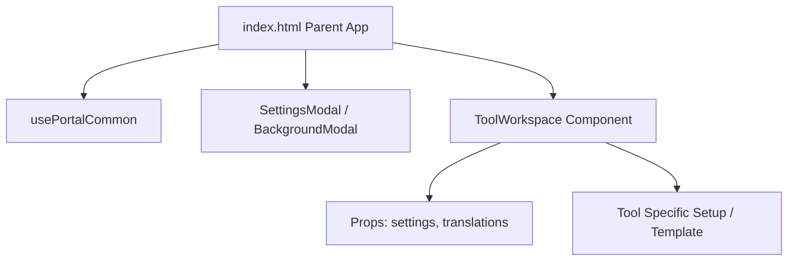

# Web Tool Scaffolding & Development Guide

このドキュメントは、`free-web-tools` プロジェクトに新しく便利ツールを追加する際、ユーザー体験（UX）と品質を共通化するための**開発ガイドライン**です。
すべての新規ツールは、本リポジトリの [tool-template/](file:///E:/Tfiles/Tbox/Sites/free-web-tools/tool-template/) ディレクトリをコピーして作成されます。

---

## 1. 共通アセットアーキテクチャの概要（疎結合 Vue コンポーネント設計）

すべてのツールは、プレミアムな統一デザインと一貫したカスタマイズ機能を提供するため、外枠となる共通アセット（テーマ設定、背景設定、ヘッダー、フッター、設定モーダル等）が `index.html` 側に最初から標準装備されています。

開発者は、ツール固有のメイン UI およびロジックを **`ToolWorkspace` という Vue コンポーネント**に分離してカプセル化します。これにより、ツール個別のロジックと共通インフラ（モーダルや背景画像レイヤーなど）が完全に疎結合になり、メンテナンス性と開発効率が最大化されます。



---

## 2. 共通機能の自動適用仕様

外枠の親アプリと共通ライブラリ `portal_common.js` により、以下の共通機能が自動適用されます。

### ① 多言語対応 (i18n)
* **自動判別**: 初回起動時（LocalStorageに保存された設定が無い場合）は、ブラウザの言語設定（`navigator.language`）に基づいて自動的に `ja` または `en` を適用します。
* **動的フェッチ**: 親アプリが非同期で `./i18n.json` をロードし、`translations` 状態変数に格納します。
* **コンポーネントでの利用**: 親から props を介して `translations` と `settings` が `ToolWorkspace` に渡されます。コンポーネントの `setup` 内で簡易的な `t(key)` 翻訳ヘルパーを定義することで、`{{ t('key') }}` のようにリアクティブ翻訳が行えます。
* **言語切り替えUI**: 設定モーダル内に言語切り替えトグル（`EN / JA`）が自動で設置されています。

### ② テーマカラー切り替えと Tailwind CSS 連携
* **CSS変数による制御**: `:root`、`.theme-light`、`.theme-neon` にて共通の CSS カスタムプロパティ（`--bg-primary`, `--bg-card`, `--border-color`, `--text-main`, `--text-muted`, `--accent-color` 等）が定義されています。
* **Tailwind CSS の `dark:` クラス連動**: テーマが `light` に切り替わった場合、`#theme-root` 要素から `dark` クラスを動的に削除し、ライトモードに切り替わります。

### ③ 背景画像のパーソナライズ (Background Customizer)
* **背面レイヤー設計**: 背景画像はコンテンツの背面に `z-0` レイヤーとして配置され、不透明度とぼかし量が Vue.js のデータとリアルタイムにバインドされます。
* **スライダー調整**: 設定モーダル内のスライダーを用いて、透過度（不透明度 `0.0` 〜 `0.8`）およびぼかし量（`0px` 〜 `24px`）をシームレスに変更できます。

### ④ 永続化保存 (LocalStorage)
* すべてのユーザー設定（表示言語、選択テーマ、背景画像URL、透過度、ぼかし量、および各ツールのカスタム設定）は、`localStorage` の `tool-settings` キーに JSON 文字列として自動保存・復元されます。

### ⑤ 全画面表示 (Fullscreen API)
* ブラウザ標準の Fullscreen API を呼び出し、ツールをディスプレイ全体に表示できます。

---

## 3. ツール固有のカスタム設定を追加する手順

共通テンプレートに用意されている `custom` オブジェクトとプレースホルダーを利用して、各ツール独自の設定項目を追加できます。

### Step 1: 親アプリでの設定初期値の定義
`index.html` 内の `DEFAULT_SETTINGS` オブジェクトの `custom` に、独自のキーとデフォルト値を定義します。

```javascript
const DEFAULT_SETTINGS = {
  lang: 'en',
  theme: 'dark',
  bgUrl: 'https://images.unsplash.com/photo-1618005182384-a83a8bd57fbe?q=80&w=1964&auto=format&fit=crop',
  bgOpacity: 0.15,
  bgBlur: 8,
  // ツール固有の設定を追加
  custom: {
    showSeconds: true,  // 例: 時計ツールで秒針を表示するかどうか
    use24h: false       // 例: 24時間表記を使用するかどうか
  }
};
```

### Step 2: 設定モーダル UI の修正
`index.html` の `<settings-modal>` コンポーネントに必要に応じてカスタム設定用の項目を追加します。（あるいは、`settings.custom.use24h` などを直接バインドできるようにします。）

### Step 3: 多言語ファイル `i18n.json` への文言追加
設定画面で使用する多言語ラベルキーを `i18n.json` に追記します。

---

## 4. 新規ツールの追加プロセス（疎結合テンプレートによる実装）

1. **新規リポジトリの作成**: GitHub上に `monocy/tool-<new-id>` リポジトリを新規作成します。
2. **テンプレートのコピー**: [tool-template/](file:///E:/Tfiles/Tbox/Sites/free-web-tools/tool-template/) の全ファイルをコピーしてそのリポジトリに配置します。
3. **`ToolWorkspace` への固有実装**:
   - `ToolWorkspace` コンポーネントの `template` プロパティ内に、ツールのメイン UI HTML を記述します。
   - `setup(props)` にツール固有の状態（`ref` や `reactive`）、計算処理、APIフェッチ、イベントハンドラー等のロジックをすべてカプセル化して記述します。
   - UI上の表示テキストは `i18n.json` に定義し、`{{ t('key') }}` を使用して出力します。
   - キーボードショートカットなどグローバルなリスナーを登録する際は、`onMounted` で登録し、`onUnmounted` で必ずクリーンアップします。また、設定モーダルなどが開いている時はキーイベントを無視するようにガードを入れます。
     ```javascript
     const handleKeyDown = (e) => {
       // フォーカスが入力要素にある、またはモーダルダイアログが開いているときは処理を無視
       const activeEl = document.activeElement;
       if (activeEl && (activeEl.tagName === 'INPUT' || activeEl.tagName === 'SELECT' || activeEl.tagName === 'TEXTAREA' || activeEl.isContentEditable)) {
         return;
       }
       if (document.querySelector('.modal-content') || document.querySelector('[role="dialog"]')) {
         return;
       }
       // 固有キー処理...
     };
     ```
4. **検証とプッシュ**: `python .ai/tests/smoke_app.py` を実行して、エラーがないことを確認の上、GitHubへプッシュします。
5. **親へのサブモジュール追加**: 親リポジトリ `free-web-tools` にて Git サブモジュールとして登録します。
   ```bash
   git submodule add https://github.com/monocy/tool-<new-id>.git assets/official/free_web_tools/tools/<new-id>
   ```
